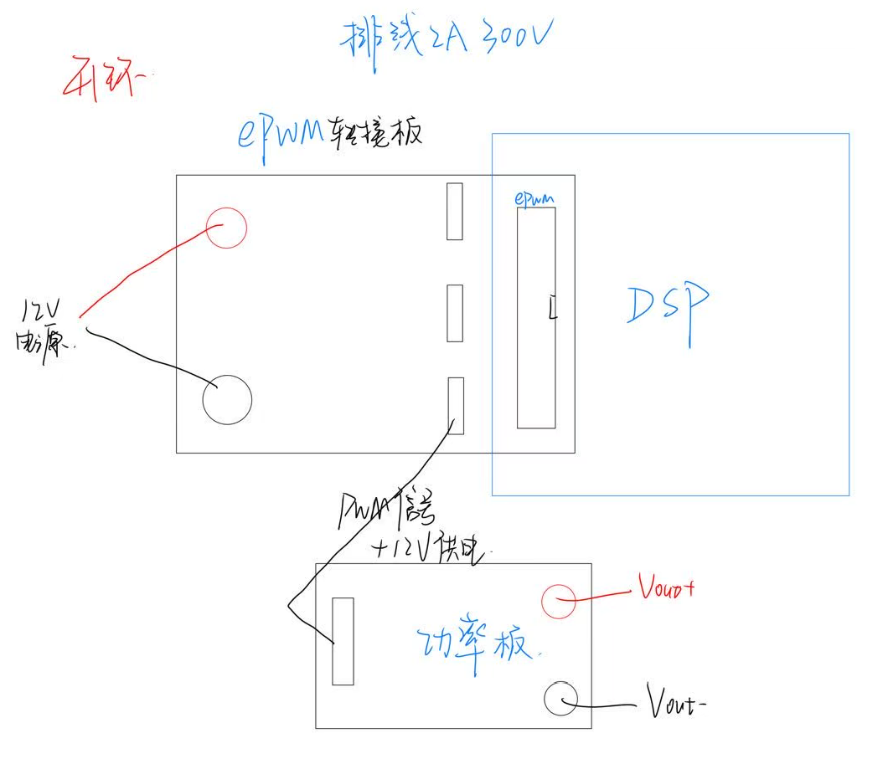
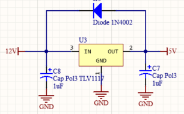
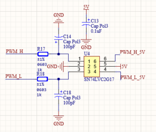
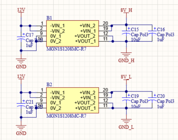
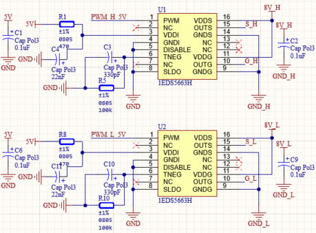
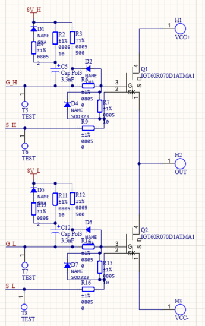

# 设计思路

先进行开环的测试，后根据需要加入ADC转接板（SMA连接）进行闭环测试

开环测试思路

# 结构设计

所以就分为EPWM转接板和主功率板两部分硬件进行设计

主功率板：

1.供电模块 2.缓冲电路 3.隔离稳压电路 4.栅极驱动电路 5.主功率桥

EPWM转接板（4层板，电源信号隔离）：

1.12V供电端口 2.三个排针连接主功率板 3.20pin排母连接EPWM模块

# 原理图设计

## 供电电路设计

主要采用TLV1117芯片进行稳压，输入端口通过排插输入12V的直流电压，经过稳压后得到5V电压，用于施密特触发器芯片供电以及栅极驱动芯片的供电，设计二极管保护电路，防止12V与5V电源短接。

## 缓冲电路设计

主要采用SN74LVC2G17 双施密特触发缓冲器，对高低端驱动的PWM进行缓冲与整形，提升信号的驱动能力和抗干扰能力，使得PWM能输出更稳定的5V电平信号，确保PWM信号在传输和处理过程中保持良好的波形质量。

## 隔离稳压电路设计

主要采用MGNS11208M (R-7) 芯片，用于将12V的输入电压转换为8V的输出，分高低两侧，这是为了给GaN增强型Mos的栅极驱动电路**提供单独的上拉**，需要8V的独立电源，故需要对8V电源进行隔离，分高低两侧。

## 栅极驱动电路设计

主要采用1EDS5663H栅极驱动芯片，用于驱动功率桥，实现对PWM信号的功率放大，输出高驱动能力的控制信号。特别注意这里的VDDI引脚输入位5V经过470Ω的电阻分压输入，根据数据手册分析，VDDI引脚通常输入3.3V电压，这里可能是考虑到5VPWM信号的注入（PWM/DISABLE引脚允许最大输入电压为6.5V）和G/S双端输出的高功率PWM信号，3.3V的供电不足以驱动。

OUTG连接GaN MOS栅极，OUTS连接GaN MOS源极，PWM引脚选通OUTG/OUTS。

## 主功率桥设计

主要采用IGT60R070D1ATMA1增强型Mos作为主功率桥，实现对大功率负载的开关控制，通过 G_H、S_H 和 G_L、S_L 输入的驱动信号，控制 Q1、Q2 的导通与关断，从而在 OUT 端实现功率输出。IGT60R070D1ATMA1 是高压功率 MOS 管，用于承载大电流、高电压的功率传输。该增强型Mos必须运行在5~6.5V的栅极驱动下。

由二极管（D1-D4、D5、D6）、电阻（R2-R4、R7、R11-R13、R16 等）、电容（C2、C12）组成，起到信号驱动、电压钳位、过压保护等作用，确保 MOS 管稳定可靠工作。注意设计齐纳二极管对GS端进行稳压，但是也要尽量避免齐纳二极管产生的振铃现象导致驱动Mos的电压过冲而击穿。为减小齐纳二极管产生的振铃或减小环路电感请看Readme手册。

## RC吸收电路设计

主要避免电压过冲击穿Mos管。降压式缓冲电路
