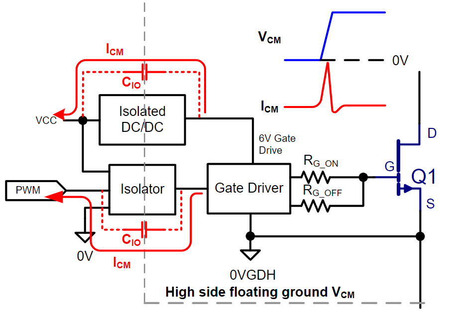
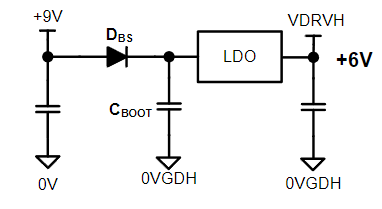

# GaN-Design
### GaN E-HEMT

高电子迁移率增强型GaN晶体管，**晶体管在设计硬件电路中需要单独供电**

有特殊的反向导通特性，提供低阻抗的续流通道，还可应用于功率双向流动的场景。

###  Optimizing Gate Resistors

Turn-on gate resistor R_GON=10~20Ω

Turn-off gate resistor R_GOFF=1~3Ω，作为栅极驱动需要提供单独的强下拉

R_GOFF对功率损耗的影响较大，适当的参数可以减小功率损耗

### Preventing Miller turn-on

1.用小的Turn-off gate resistor R_GOFF

2.减小栅极回路电感

3.建议-2~-3V的负栅极电压

### Using Clamping Diode

单输出栅极驱动电路推荐使用钳位二极管

在栅极源极之间使用快恢复的肖特基二极管或者齐纳二极管，但是要小心齐纳二极管引起的栅极振铃现象

### High side driver

利用全隔离栅极驱动，隔离电源减小绕组间电容

利用自举驱动，减小损耗简化设计，使用自举后通常需要进行后调节和电压钳位

### Bootstrap Design

1.Bootstrap with post-regulation

Example：

2.Using Zener for clamping

### Preventing Oscillations

造成栅极振荡的原因：

1.含有共源电感的反馈回路（从电源侧回路到栅极回路）

2.通过米勒电容C_GD进行电容耦合（米勒电容：栅极漏极之间的寄生电容）

3.反馈相移为-180°会不受控的振荡

**如何避免寄生振荡**：

1.减少/小共源电感以及栅极上的电感，并且最小化外部寄生电容C_GD，C_GD的核心问题是在开关过程中形成 “密勒平台”（栅极电压停滞期），延长开关时间。通过增强驱动能力，可快速充放电C_GD，缩短平台时间。驱动电路的上拉 / 下拉管采用低阻抗设计，确保在开关瞬间提供足够的电流，抑制密勒效应。

- **缩短栅极 - 漏极走线长度**：栅极和漏极的铜箔走线之间会形成额外的寄生电容，应尽量缩短两者的平行距离，避免交叉或大面积重叠。
- **优化接地与屏蔽**：将源极接地铜箔靠近栅极，形成 “屏蔽”，减少漏极高频信号通过空间耦合到栅极的路径，降低等效耦合电容。

2.降低导通速度来减小电压变化率和栅极振铃现象

3.减少额外的栅源寄生电容

4.使用铁氧体磁珠抑制高频噪声（小的贴片磁珠阻抗=10~20Ω）

### Gate Driver selection

#### Non-isolated single gate driver：

最低要求：

1.必须运行在5~6.5V的栅极驱动下

2.低下拉输出阻抗：R_OL ≤ 2Ω

3.2A或者更高的峰值驱动电流用于关断

4.低电感贴片封装（可降低寄生电感）

偏好建议：

1.驱动引脚要有**单独的上拉/下拉**

2.小于等于1Ω的下拉阻抗

3.传播延迟<20ns

4.集成的LDO用来调节5~6V的栅极驱动

5.高频电容（>1MHz）

#### Isolator/Isolated gate driver：

1.CMTI rating(共模瞬态抗扰度)：**共模瞬态电压快速变化时，抵抗误触发或干扰的能力**的关键指标，单位通常为 kV/μs（千伏每微秒）。CMTI 额定值越高，说明器件在面对快速变化的共模电压时，仍能保持稳定工作的能力越强。

常见的GaN开关在开关节点是50-100kV/us 的dv/dt，650V的GaN HEMT需要更高的CMTI，建议100-200kV/us

2.为实现高开关频率和最小化死区时间，对高低侧延迟匹配的要求：

- 对于 650V 且使用隔离驱动器的应用场景，高低侧延迟匹配在 50 - 100ns之间，优选不超过 50ns。
- 对于 100V 且不使用隔离驱动器的应用场景，高低侧延迟匹配优选小于 20ns。

# AD快捷键

让PCB上选中的元器件按照矩形区域摆放：TOL

原理图快捷键
特殊粘贴:EY
右对齐:AR
左对齐:AL
上对齐:AT
下对齐:AB
对齐方式:AA
放大缩小:CTRL+鼠标滑轮
左右移动:鼠标右键
调节栅栏:G

PCB快捷键
设置栅格:GG
单位切换:Q
3D图:3
2D图:2
旋转3D图:V+B
跳转到中心点:CTRL+END
定位中心:E,F,C
选择移动:M
板形状:DSD
换层:shift+s
电源线线宽:15-60mil
设置旋转器件的角度:TP
复位错误:TM
调方格为点:CTRL+G然后点Dots
丝印位置的调整:任意选择一个器件然后CTRL+A，点击A,P选择定位
覆铜:PG
过孔大小:0.4mm-0.6mm
走线状态，+tab，改变线宽；
2d线状态，+shift+tab ，切换倒角方式；
crtl+左键 ：高亮选中网络；
左下角双击，层管理，显示或隐藏某一层；
旋转：Space；
X轴镜像：X；
Y轴镜像：Y；
板层管理：L；
栅格设置：G；
单位进制切换：Q；
对齐-水平：A，D；
对齐-垂直：A，I，I，Enter；
对齐-顶部：A，T；
对齐-底部：A，B；
对齐-左侧：A，L；
对齐-右侧：A，R；
设计-类设置：D，C;
设计-板层管理：D，K；
设计-规则：D，R；
设计-规则向导：D，W；
设计-拷贝ROOM格式：D，M，C；
设计-放置ROOM：D，M，R；
设计-根据选择对象定义板子形状：D，S，D；
设计-编辑网络：D，N，N；

编辑-删除：E，D；
编辑-切断轨迹：E，K；
编辑-设定原点：E，O，S；
编辑-复位原点：E，O，R；

移动-移动：M，M；
移动-拖拽：M，D；
移动-器件：M，C；
移动-打断走线：M，B；
移动-器件翻转板层：M，I；

网络-显示网络：N，S，N；
网络-显示器件：N，S，O；
网络-显示全部：N，S，A；
网络-隐藏网络：N，H，N；
网络-隐藏器件：N，H，O；
网络-隐藏全部：N，H，A；

放置-坐标：P，O；
放置-焊盘：P，P；
放置-字符：P，S；
放置-过孔：P，V； 走线快速添加过孔：ctrl+shift+滚轮；
放置-多边形：P，R；
放置-填充：P，F；
放置-敷铜：P，G；
放置-线性尺寸：P，D，L；
放置-走线：P，T；
放置-差分对布线：P，I；
放置-多根布线：P，M，Enter；

选择-全选：S，A；
选择-线选：S，L；
选择-区域（内部）：S，I；

选择-区域（外部）：S，O；

选择网络：S,P;

工具-交叉探测对象：T，C；(+Ctrl:跳转到目标文件)
工具-泪滴选项：T，E；
工具-设计规则检查：T，D；
工具-复位错误标志：T，M；
工具-从选择元素创建板剪切：T，V，B
工具-网络等长调节：T，R；

二、PCB
PCB铺铜：P+G

焊盘：P+P

过孔：P+V

尺寸：P+D

字符串：P+S

滴泪：P+E

PCB图画线： P+T

其他图层走线：P+L

三、原理图
网络标签：P+N

原理图绘线：P+W

字符串：P+T

指示标志：P+V

电源端口：P+O

原理图绘制直线：P+D+L

四、原理图库
放置矩形：P+R

放置管脚：P+P

阵列粘贴：P+Y

放置线：P+L

五、PCB库
放置焊盘：P+P

放置字符串：P+S

