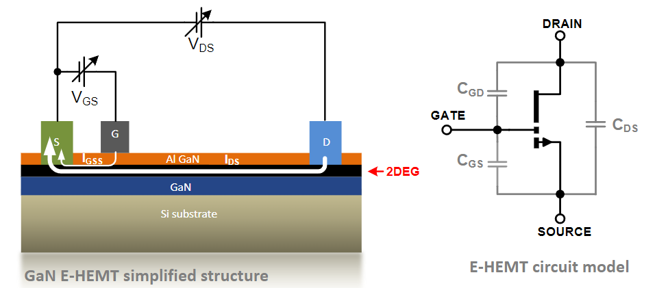
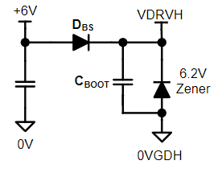

# GaN-Design
### GaN E-HEMT

高电子迁移率增强型GaN晶体管

有特殊的反向导通特性，提供低阻抗的续流通道，还可应用于功率双向流动的场景。

###  Optimizing Gate Resistors

Turn-on gate resistor R_GON=10~20Ω

Turn-off gate resistor R_GOFF=1~3Ω，作为栅极驱动需要提供单独的强下拉

R_GOFF对功率损耗的影响较大，适当的参数可以减小功率损耗

### Preventing Miller turn-on

1.用小的Turn-off gate resistor R_GOFF

2.减小栅极回路电感

3.建议-2~-3V的负栅极电压

### Using Clamping Diode

单输出栅极驱动电路推荐使用钳位二极管

在栅极源极之间使用快恢复的肖特基二极管或者齐纳二极管，但是要小心齐纳二极管引起的栅极振铃现象

### High side driver

利用全隔离栅极驱动，隔离电源减小绕组间电容

利用自举驱动，减小损耗简化设计，使用自举后通常需要进行后调节和电压钳位

### Bootstrap Design

1.Bootstrap with post-regulation

Example：

2.Using Zener for clamping

### Preventing Oscillations

造成栅极振荡的原因：

1.含有共源电感的反馈回路（从电源侧回路到栅极回路）

2.通过米勒电容C_GD进行电容耦合（米勒电容：栅极漏极之间的寄生电容）

3.反馈相移为-180°会不受控的振荡

如何避免寄生振荡：

1.减少/小共源电感以及栅极上的电感，并且最小化外部寄生电容C_GD

2.降低导通速度来减小电压变化率和栅极振铃现象

3.减少额外的栅源寄生电容

4.使用铁氧体磁珠抑制高频噪声（小的贴片磁珠阻抗=10~20Ω）

### Gate Driver selection

#### 非隔离型单栅极驱动器：

最低要求：

1.必须运行在5~6.5V的栅极驱动下

2.低下拉输出阻抗：R_OL ≤ 2Ω

3.2A或者更高的峰值驱动电流用于关断

4.低电感贴片封装（可降低寄生电感）

偏好建议：

1.驱动引脚要有单独的上拉/下拉

2.小于等于1Ω的下拉阻抗

3.传播延迟<20ns

4.集成的LDO用来调节5~6V的栅极驱动

5.高频电容（>1MHz）

#### 隔离型驱动器：

1.CMTI rating(共模瞬态抗扰度)：**共模瞬态电压快速变化时，抵抗误触发或干扰的能力**的关键指标，单位通常为 kV/μs（千伏每微秒）。CMTI 额定值越高，说明器件在面对快速变化的共模电压时，仍能保持稳定工作的能力越强。

常见的GaN开关在开关节点是50-100kV/us 的dv/dt，650V的GaN HEMT需要更高的CMTI，建议100-200kV/us

2.为实现高开关频率和最小化死区时间，对高低侧延迟匹配的要求：

- 对于 650V 且使用隔离驱动器的应用场景，高低侧延迟匹配在 50 - 100ns之间，优选不超过 50ns。
- 对于 100V 且不使用隔离驱动器的应用场景，高低侧延迟匹配优选小于 20ns。

